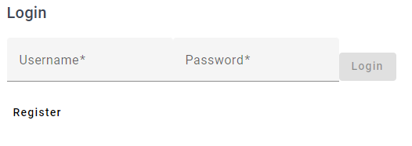
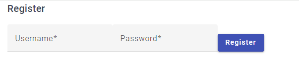
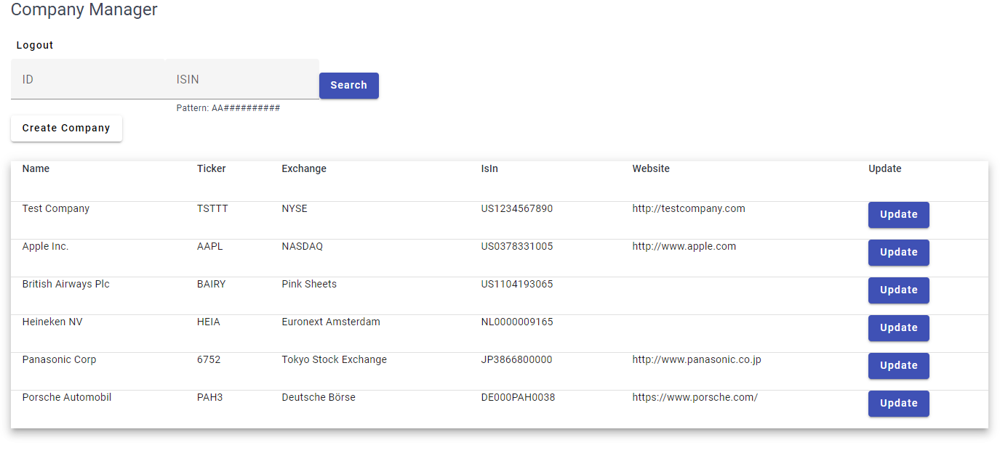
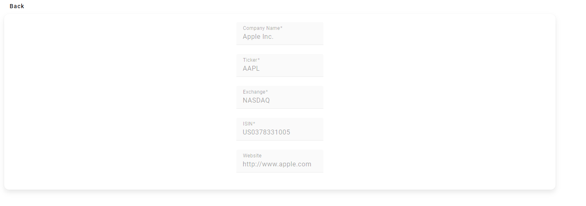
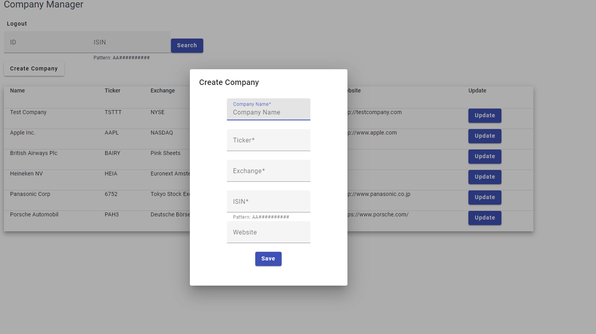
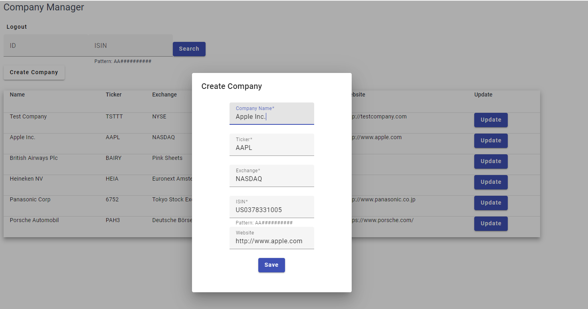

# CompanyManager

## Project Stack (The "SEAN" Stack)
- Sqlite
- Express.js
- Angular
- Node.js

## Steps to run project

### Step 1: Development UI server
1. Install node modules `npm install`
2. Run `ng serve` for a dev server. Navigate to `http://localhost:4200/`. The application will automatically reload if you change any of the source files.

### Step 2: Run Node.js Server

1. Move to `backend` directory
2. Install node modules `npm install`
3. Run `npx nodemon server.js` this will run the Node.js server (Nodemon allows auto reloading on code changes)

## Using the Application

### Create an Account

First screen that should show is the Login Page.

From there click on the **Register** button
This will bring you to the registration page

Enter a Username and a Password here. Password needs to 6 characters long

### Company Manager

After you will be sent back to the Login screen to login
Once logged in the main details page with display

### Search Company

On this page You can search a company using ID or ISIN
Once a company has been search the page will change to show the details

### Create Company

Also from the front page you can Create a Company using the **Create Company**

### Update Company

You can also update a company from the Table using the **Update** button

